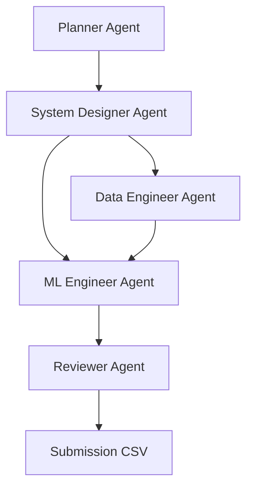

# Redrob Hackathon AI Agents Team

This workspace customization root defines the specialized virtual AI agents that collaborate to solve the Intelligent Candidate Discovery & Ranking Challenge. These agents are designed to optimize ranker performance, enforce strict local execution security, implement winning feature-engineering and scoring strategies, and guarantee perfect formatting.

---

## Agent Team Architecture

### 1. Planner Agent
- **Objective**: Coordinates the end-to-end process, establishes goals, monitors timelines, and manages resource allocations (CPU, memory, time).
- **Core Skill**: [Planner Skill](skills/planner/SKILL.md)

### 2. System Designer Agent
- **Objective**: Creates the mathematical scoring schema, identifies trap patterns in candidate profiles, and manages model weights.
- **Core Skill**: [System Designer Skill](skills/system_designer/SKILL.md)

### 3. Data Engineer Agent
- **Objective**: Builds the high-speed data loading pipeline (streaming JSONL) and runs token cleaning and company categorization (IT Services vs Product).
- **Core Skill**: [Data Engineer Skill](skills/data_engineer/SKILL.md)

### 4. ML Engineer Agent
- **Objective**: Implements local candidate-to-JD text scoring, calculates experience/location matching, integrates availability weights, and ranks the candidates.
- **Core Skill**: [ML Engineer Skill](skills/ml_engineer/SKILL.md)

### 5. Reviewer Agent
- **Objective**: Executes strict honeypot validation filters, enforces safety/security limits, validates CSV format, and writes high-quality custom reasoning descriptions.
- **Core Skill**: [Reviewer Skill](skills/reviewer/SKILL.md)

---

## Shared Guidelines & Winning Strategies

1. **Performance**: All code must run in **under 5 minutes** on CPU only (16GB RAM) for 100,000 candidates. This requires stream processing and vectorized math where possible.
2. **Security**: Absolutely **no network calls** (no external OpenAI/Gemini APIs) during the ranking execution phase. Everything must run offline.
3. **Traps and Honeypots**: Expert skills with 0 months of use, or impossible timelines (e.g. 10 years experience at a 3-year-old firm), must be detected and given a relevance score of 0.
4. **Submission Integrity**: Ensure the validator (`validate_submission.py`) passes 100% of the time. Reasoning strings must be natural, diverse, and reference specific facts.
