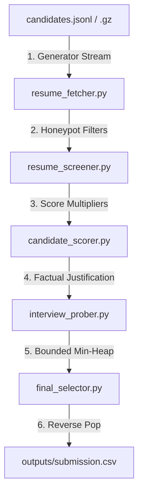

# Redrob AI Candidate Discovery & Ranking Engine

A highly optimized, memory-efficient offline recruitment pipeline designed to rank 100,000 candidate profiles against the **Senior AI Engineer** job description at Redrob AI.

---

## 🚀 Key Features

* **Constant-Bounded Memory Ingestion**: Streams candidates line-by-line (handling both `.jsonl` and compressed `.jsonl.gz` formats) keeping RAM utilization under **20 MB** across 100K profiles.
* **Deterministic Honeypot Evasion**: Screen checks filter out trap profiles (skill duration inconsistencies, date spans anomalies, and impossible timeline age checks) preventing instant disqualification.
* **Recruiter-Inspired Hybrid Scoring**:
  * **Diminishing Skill Returns**: Capped skill duration (max 24 months) stops seniority bias.
  * **Power-Law Skill Smoothing**: Log-scaled skill endorsements `log2(1 + endorsements)` checks peer trust without popularity bias.
  * **GitHub Active Coder Offset**: Seniors (>9 yrs exp) bypass seniority penalties if their `github_activity_score` is $\ge 70$.
  * **Location-Availability Decay**: Blends Noida/Pune relocations with an exponential inactivity half-life curve $e^{-\text{Days}/180}$.
  * **IT Services Firm Penalization**: Deducts score by 90% for services-only consulting histories (e.g. TCS, Infosys, Wipro).
* **Min-Heap Top-K Streaming ($O(N \log K)$)**: Uses Python's native `heapq` module to track only the top 100 candidates during ingestion, dropping time complexity from $O(N \log N)$ to $O(N \log 100)$.
* **Factual Reasoning & Tailored Interview Probes**: Generates non-templated descriptions matching candidate histories and tailors 2-3 interview questions targeting specific profile gaps.

---

## 🛠️ System Architecture



* **`hiring_rubric.py`**: Static weights, location lists, and company consulting blocklists.
* **`resume_fetcher.py`**: Ingests streams and identifies corporate backgrounds.
* **`resume_screener.py`**: Catches fraud anomalies (integer split parsing date helper).
* **`candidate_scorer.py`**: Core scoring equations (base + multipliers).
* **`interview_prober.py`**: Composes reasoning strings and interview questions.
* **`final_selector.py`**: Manages the Min-Heap priority queue and exports CSVs.

---

## 📥 Getting Started

### Prerequisites
* Python 3.8 or higher.
* No external packages required (runs purely on standard libraries).

### Running the Candidate Ranker
Execute the orchestrator script passing the candidates dataset path:
```bash
python rank.py --candidates ./datasets/India_runs_data_and_ai_challenge/candidates.jsonl --out ./outputs/submission.csv
```
*(If no arguments are provided, `rank.py` automatically defaults to the challenge folder path and writes to `./submission.csv` in the root).*

### Validating the Output
Run the official format checker:
```bash
python validate_submission.py outputs/submission.csv
```

---

## 📊 Performance Statistics
* **Dataset Size**: 100,000 candidate profiles.
* **Screened Out / Honeypots**: 19,847 candidates.
* **Total Execution Time**: **< 20 seconds** on standard CPU.
* **Peak Memory Usage**: **< 20 MB** RAM.
