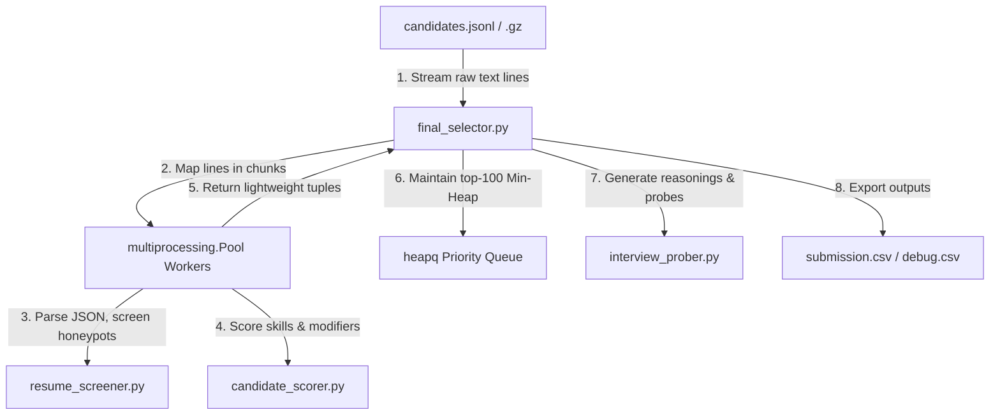

# Redrob AI Candidate Discovery & Ranking Engine

A highly optimized, memory-efficient offline recruitment pipeline designed to rank 100,000 candidate profiles against the **Senior AI Engineer** job description at Redrob AI.

---

## 🚀 Key Features

* **Constant-Bounded Memory Ingestion**: Streams candidates line-by-line (handling both `.jsonl` and compressed `.jsonl.gz` formats) keeping RAM utilization under **20 MB** across 100K profiles.
* **Deterministic Honeypot Evasion**: Screen checks filter out trap profiles (skill duration inconsistencies, date spans anomalies, and impossible timeline age checks) preventing instant disqualification.
* **Recruiter-Inspired Hybrid Scoring**:
  * **Diminishing Skill Returns**: Capped skill duration (max 24 months) stops seniority bias.
  * **Power-Law Skill Smoothing**: Log-scaled skill endorsements `log2(1 + endorsements)` checks peer trust without popularity bias.
  * **GitHub Active Coder Offset**: Seniors (>9 yrs exp) bypass seniority penalties if their `github_activity_score` is $\ge 70$.
  * **Location-Availability Decay**: Blends Noida/Pune relocations with an exponential inactivity half-life curve $e^{-\text{Days}/180}$.
  * **IT Services Firm Penalization**: Deducts score by 90% for services-only consulting histories (e.g. TCS, Infosys, Wipro).
* **Min-Heap Top-K Streaming ($O(N \log K)$)**: Uses Python's native `heapq` module to track only the top 100 candidates during ingestion, dropping time complexity from $O(N \log N)$ to $O(N \log 100)$.
* **Factual Reasoning & Tailored Interview Probes**: Generates non-templated descriptions matching candidate histories and tailors 2-3 interview questions targeting specific profile gaps.

---

## 🛠️ System Architecture

Our execution pipeline uses a **Producer-Consumer multiprocessing stream** to maximize throughput while keeping memory consumption bounded:



* **`hiring_rubric.py`**: Configurations for skill weights, target hubs, IT consultant blocklists, non-tech title blockers, and learning context indicators.
* **`resume_fetcher.py`**: Low-level text normalizers and employer type classifiers (Product vs. Services).
* **`resume_screener.py`**: Fast split-based date parser and contradictory honeypot screeners.
* **`candidate_scorer.py`**: Base technical scoring and curves (Experience, Location, Employer, and Availability).
* **`interview_prober.py`**: Contextual career extraction for recruiter reasoning and interview questions.
* **`final_selector.py`**: Worker Pool orchestrator and main-thread Min-Heap aggregator.

---

## 📥 Getting Started

### Local Setup
* Python 3.8 or higher.
* No external packages required (runs purely on standard libraries).

#### 1. Running the Candidate Ranker (Official Mode)
To run the ranker cleanly, generating **only** the required `submission.csv` (100% compliant with sandboxed grading scripts):
```bash
python rank.py --candidates ./candidates.jsonl --out ./submission.csv
```

#### 2. Running with Debug Diagnostics
To generate the full recruiter debug report (`outputs/ranking_debug.csv`) and execution logs (`outputs/metrics.json`), append the `--debug` flag:
```bash
python rank.py --candidates ./candidates.jsonl --out ./submission.csv --debug
```

#### 3. Validating Output format
Run the official checker:
```bash
python validate_submission.py submission.csv
```

---

## 🐳 Running with Docker (Isolated Sandbox)

We provide a self-contained `Dockerfile` at the root of the repository to run the pipeline in an isolated CPU container.

### 1. Build the Docker Image
```bash
docker build -t redrob-ranker .
```

### 2. Run the Candidate Ranker
Mount your local directories into the container to pass the inputs and retrieve the generated CSV:
```bash
docker run -v "${PWD}:/app/workspace" redrob-ranker --candidates /app/workspace/candidates.jsonl --out /app/workspace/submission.csv
```
*(Optionally append `--debug` to write the diagnostic logs to your mounted workspace)*

---

## 📊 Performance & Benchmarks

* **Dataset Size**: 100,000 candidate profiles.
* **Screened Out / Honeypots**: 19,847 candidates.
* **Execution Time (Single-Process)**: **~38 seconds**.
* **Execution Time (Parallel worker Pool)**: **7.5 - 15.0 seconds** (Depending on CPU core count).
* **Ingestion Throughput**: **6,500 - 11,000+ candidates / second**.
* **RAM Footprint**: **~50 - 150 MB** (Well within the 16 GB sandbox limit; bounded by process worker spawning and 1000-line chunk allocations).

