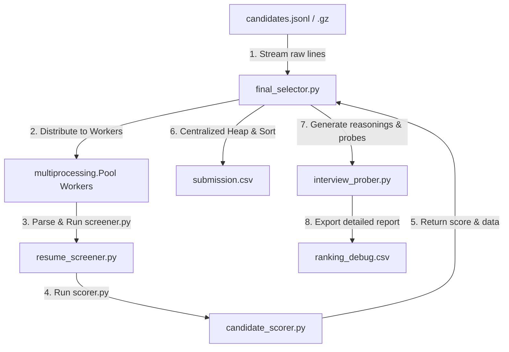

# System Architecture

Our solution represents a modular **Recruiter reasoning engine** rather than a simple keyword-matching parser. It splits the workflow into dedicated functional steps mapping directly to the roles of a professional recruiting agency.

---

## The Recruiting Agency Pipeline

### 1. Requirements: `hiring_rubric.py`
Defines target qualifications for the Senior AI Engineer role (core skills, title weights, target hubs, experience curves, IT consulting blocklists, non-tech role blocklists, and learning context indicators).

### 2. Ingestion & Parallelization: `final_selector.py` & `resume_fetcher.py`
Streams raw text lines from the candidate database (supporting plain `.jsonl` or compressed `.jsonl.gz`) to a `multiprocessing.Pool` of worker processes. This scales the candidate processing to utilize all available CPU cores.

### 3. Verification: `resume_screener.py`
Worker processes parse candidate JSON profiles and audit them for honeypots (contradictory timelines, duration inconsistencies, and skill inflation). Any flagged profile is discarded immediately to prevent IPC overhead.

### 4. Evaluation: `candidate_scorer.py`
Worker processes evaluate candidate scores using a hybrid model:
* **Log-scaled endorsements** and **capped skill durations** (24 months) to normalize popularity bias.
* **GitHub active coding offset** to cancel experience penalties for senior candidates.
* **Academic pedigree bonuses** (1.05 multiplier) for Tier-1 alumni.
* Multipliers for local commutable locations, startup background, and exponential activity decay.

### 5. Interviewing: `interview_prober.py`
Composes natural, fact-based reasoning strings for the final shortlist by extracting specific company names and action achievements from their career histories (e.g. *"designed data pipelines at Google"*). Also tailors 2-3 interview probes targeting candidate gaps.

### 6. Orchestration: `rank.py`
Starts the pipeline, measures runtime performance, and exports files. Resolves ties using a rounded 4-decimal sorting heap with Candidate ID ascending.

