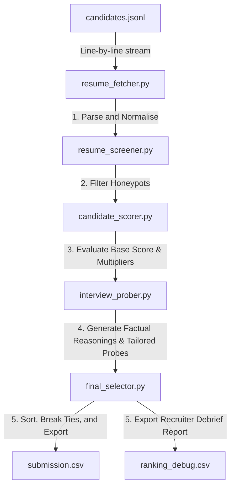

# System Architecture

Our solution represents a modular **Recruiter reasoning engine** rather than a simple keyword-matching parser. It splits the workflow into dedicated functional steps mapping directly to the roles of a professional recruiting agency.

---

## The Recruiting Agency Pipeline

### 1. Requirements: `hiring_rubric.py`
Defines the target qualifications for the Senior AI Engineer role (AI core skills, title weights, Pune/Noida target locations, experience Sweet spots, and IT consulting blocklists).

### 2. Ingestion: `resume_fetcher.py`
Streams candidate objects line-by-line to maintain a constant memory profile. Normalizes text strings to lowercase and classifies the candidate's historical employers (Product vs. Services).

### 3. Verification: `resume_screener.py`
Inspects each profile for obvious disqualifications (such as overseas residents requiring visa sponsorship) and logical contradictions (trap profiles or honeypots).

### 4. Evaluation: `candidate_scorer.py`
Calculates technical base scores (max 100 points) and applies weight multipliers:
- **Experience**: Curve peaked at 6–8 years.
- **Location**: Noida/Pune residents and relocatable Tier-1 candidates.
- **Employer**: Startups/Product company history favored.
- **Availability**: Exponential platform engagement decay based on days since last active date.

### 5. Interviewing: `interview_prober.py`
Writes factual, non-templated reasoning strings for each shortlist candidate (referencing years, title, skills, and notice period). Also generates 2–3 tailored interview questions targeting candidate gaps.

### 6. Orchestration: `final_selector.py` & `rank.py`
Runs the pipeline end-to-end, resolves equal score ties lexicographically by ascending candidate ID, slices the top 100 "selected employees", and writes the files.
